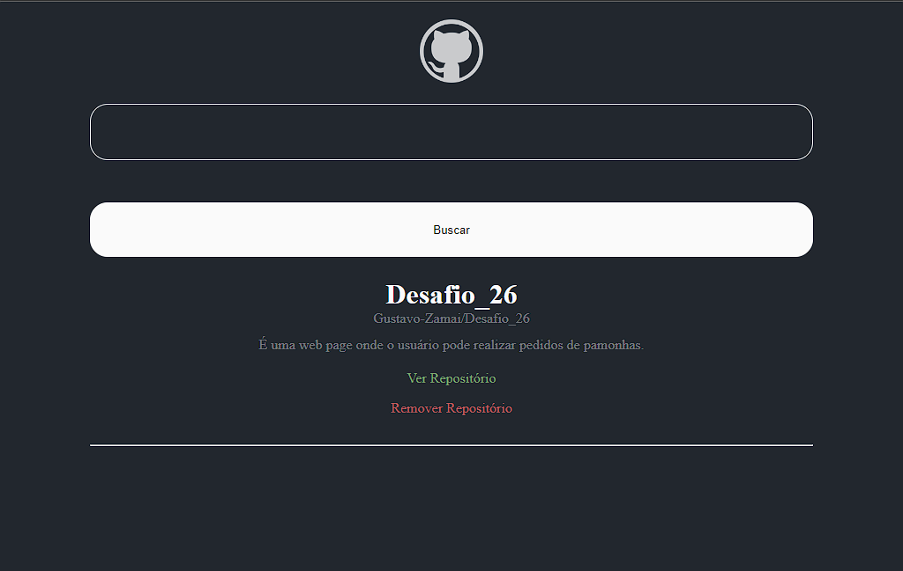

<h1 align="center">Github Wiki</h1>

  

  <a href="#-tecnologias">Tecnologias</a>&nbsp;&nbsp;&nbsp;|&nbsp;&nbsp;&nbsp;
  <a href="#-projeto">Projeto</a>&nbsp;&nbsp;&nbsp;|&nbsp;&nbsp;&nbsp;
  <a href="#-layout">Layout</a>&nbsp;&nbsp;&nbsp;|&nbsp;&nbsp;&nbsp;
  <a href="#-aprendizado">Aprendizado</a>&nbsp;&nbsp;&nbsp;|&nbsp;&nbsp;&nbsp;
  <a href="#-licença">Licença</a>

  

 

  

---
## 🚀 Tecnologias

Esse projeto foi desenvolvido com as seguintes tecnologias:

- HTML e CSS
- JavaScript
- React
- API
- Axios
- JSON
- Git e Github

---
## 💻 Projeto

É um buscador de repositórios do Github, onde você pode ter seus repositórios favoritos em um só lugar.

<!--[Acesse o projeto em andamento, online](https://Gustavo-Zamai.github.io/Pokedex)
-->

---
## 🔖 Layout

Esse projeto não teve layout disponibilizado, ele foi desenvolvido durante o segundo modulo da Formação React Developer.

---

## 📑 Aprendizado

Durante o desenvolvimento desse projeto reforcei conceitos de componentes do React, e trabalhei com funções assíncronas, esperando respostas da API do Github. 
Utilizei o Axios para fazer o trabalho/conexão com a API, e trabalhei com arquivos JSON.

---
## 📝 Licença

Esse projeto está sob a licença MIT.

---

Feito com ♥ por Gustavo Zamai
